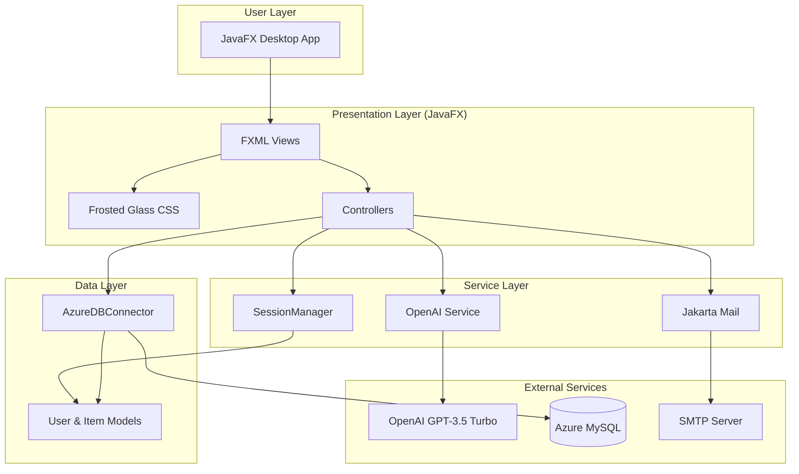
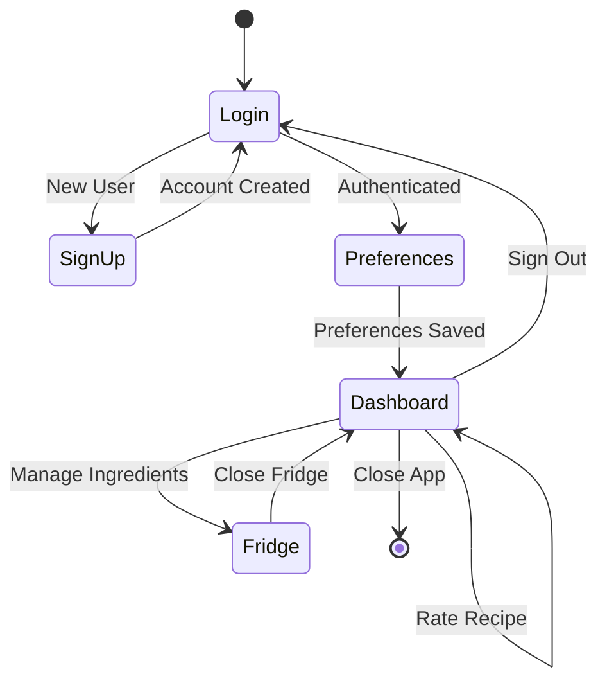
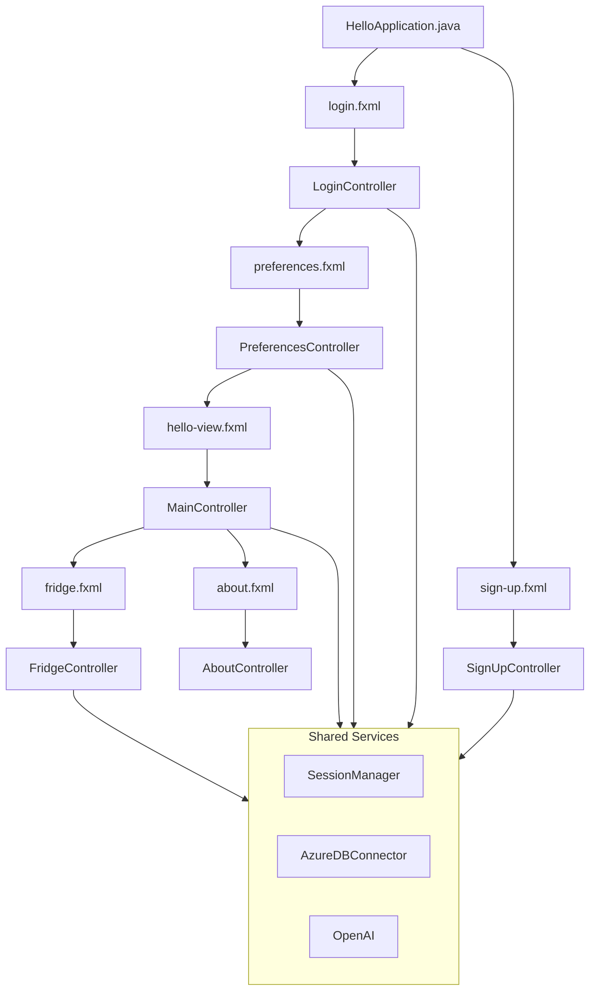
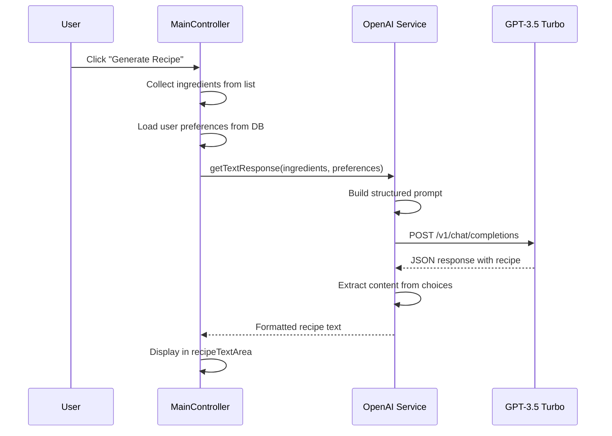
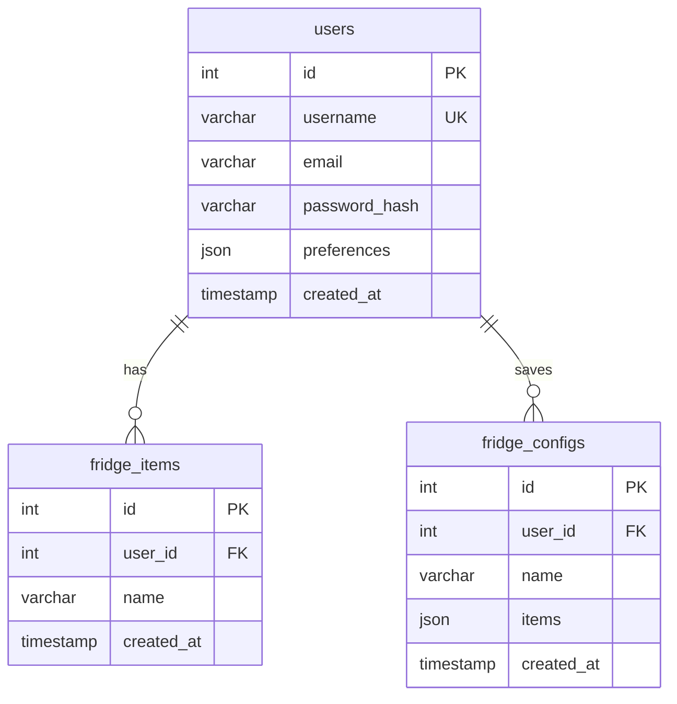

# System Architecture

Detailed technical documentation of FlavorBot's architecture, design patterns, and system integrations.

---

## High-Level Architecture



---

## Application Flow



---

## MVC Component Hierarchy



---

## State Management Strategy

### Session Management
The `SessionManager` class implements the Singleton pattern to maintain user state across the application:

```java
// Singleton Session Manager
public class SessionManager {
    private static SessionManager instance;
    private User currentUser;
    
    public static SessionManager getInstance();
    public User getCurrentUser();
    public void setCurrentUser(User user);
}
```

### State Distribution

| State Category | Location | Purpose |
|----------------|----------|---------|
| **User Session** | `SessionManager` | Current authenticated user |
| **User Data** | `User` model | ID, username, email, preferences |
| **Fridge Items** | `AzureDBConnector` | Per-user ingredient storage |
| **Preferences** | JSON in DB | Dietary restrictions, skill level |
| **UI State** | Controllers | Form inputs, selections, dialogs |

---

## AI Integration Architecture

### Recipe Generation Flow



### Prompt Engineering

The AI prompt is structured for professional chef-quality output:

```
System: "You are a professional chef with expertise in creating 
        detailed and structured recipes."

User: "Based on the preferences: {dietary restrictions, skill level}, 
      and the following ingredients: {ingredient list}, 
      generate a detailed recipe with clear instructions.
      
      Include sections:
      - Ingredients
      - Preparation
      - Cooking Steps
      - Tips
      - Serving Suggestions"
```

---

## Database Schema

### Azure MySQL Tables



### User Preferences JSON Structure

```json
{
  "dietaryRestrictions": ["vegetarian", "gluten-free"],
  "skillLevel": "intermediate",
  "mealType": ["dinner", "lunch"],
  "spiceLevel": "medium",
  "cuisinePreferences": ["Italian", "Asian"],
  "allergies": ["peanuts"]
}
```

---

## File Organization

```
FlavorBot/
├── src/main/java/
│   ├── module-info.java
│   └── edu/farmingdale/recipegenerator/
│       ├── HelloApplication.java    # App entry point
│       ├── LoginController.java     # Authentication
│       ├── SignUpController.java    # User registration
│       ├── PreferencesController.java # User preferences
│       ├── MainController.java      # Main dashboard (560 lines)
│       ├── FridgeController.java    # Ingredient management
│       ├── AboutController.java     # About window
│       ├── OpenAI.java              # GPT API integration
│       ├── AzureDBConnector.java    # Database operations
│       ├── SessionManager.java      # Singleton session
│       ├── User.java                # User model
│       └── Item.java                # Fridge item model
├── src/main/resources/
│   ├── Styling/
│   │   ├── style.css                # Main styles
│   │   ├── frosted-glass.css        # Glassmorphic effects
│   │   ├── preference.css           # Preferences page
│   │   └── fridge.css               # Fridge window
│   ├── edu/farmingdale/recipegenerator/
│   │   ├── hello-view.fxml          # Main dashboard
│   │   ├── login.fxml               # Login screen
│   │   ├── sign-up.fxml             # Registration
│   │   ├── preferences.fxml         # Preferences form
│   │   ├── fridge.fxml              # Fridge manager
│   │   └── about.fxml               # About dialog
│   └── images/                       # Icons and assets
└── pom.xml                           # Maven configuration
```

---

## Security Considerations

| Concern | Mitigation |
|---------|------------|
| **API Key Exposure** | Environment variable `key` for OpenAI API |
| **Password Storage** | Hashed passwords in database |
| **SQL Injection** | PreparedStatement for all queries |
| **Session Security** | Singleton pattern with in-memory state |
| **Email Credentials** | Environment variables for SMTP auth |

---

## Design Patterns Used

| Pattern | Implementation |
|---------|----------------|
| **MVC** | FXML views, Controllers, Models |
| **Singleton** | `SessionManager` for user state |
| **DAO** | `AzureDBConnector` for data access |
| **Observer** | JavaFX property bindings |
| **Factory** | `FXMLLoader` for view creation |
