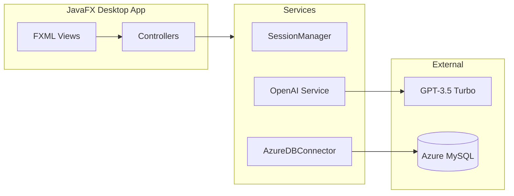

<div align="center">

# FlavorBot

**AI-powered recipe generator — enter ingredients, set preferences, get personalized recipes instantly.**

[](https://openjdk.org/)
[](https://openjfx.io/)
[](https://openai.com/)
[](https://azure.microsoft.com/products/mysql/)

[Architecture](ARCHITECTURE.md) · [Features](FEATURES.md) · [Tech Stack](TECH_STACK.md)

</div>

---

## Overview

FlavorBot is a JavaFX desktop application that generates AI-powered recipes from user-supplied ingredients. Users maintain a virtual fridge of available ingredients, drag items into the recipe generator, configure dietary and skill-level preferences, and receive a tailored recipe from GPT-3.5 Turbo. Recipes can be exported to file or shared via email. User accounts and preferences are persisted to a MySQL database hosted on Azure.

---

## Screenshots

<div align="center">

| Login | Main Dashboard |
|:---:|:---:|
|  |  |

| Preferences | Recipe Generation |
|:---:|:---:|
|  |  |

| Virtual Fridge |
|:---:|
|  |

</div>

---

## Demo

[](https://www.youtube.com/watch?v=0UNjeKQFY9I)

*Ingredient input → Preference selection → AI recipe generation → Export & share*

---

## Features

| Feature | Description |
|---|---|
| AI Recipe Generation | GPT-3.5 Turbo generates recipes tailored to your available ingredients |
| Virtual Fridge | Persistent ingredient storage per user account |
| Drag-and-Drop | Transfer ingredients from the fridge to the recipe generator |
| User Preferences | Dietary restrictions, skill level, and cuisine preferences |
| Export | Save generated recipes to a local file |
| Email Sharing | Send recipes directly via Jakarta Mail |
| Recipe Rating | Rate generated recipes to provide feedback |

---

## Architecture



---

## Project Structure

```
FlavorBot/
├── src/main/java/edu/farmingdale/recipegenerator/
│   ├── HelloApplication.java       # App entry point
│   ├── MainController.java          # Main dashboard controller
│   ├── LoginController.java         # Authentication controller
│   ├── PreferencesController.java   # User preferences controller
│   ├── FridgeController.java        # Ingredient management
│   ├── OpenAI.java                  # GPT-3.5 integration
│   ├── AzureDBConnector.java        # Database layer
│   └── SessionManager.java          # User session state
├── src/main/resources/
│   ├── Styling/                     # CSS stylesheets
│   └── edu/farmingdale/recipegenerator/
│       └── *.fxml                   # UI layouts
└── pom.xml
```

---

## Getting Started

**Prerequisites:** Java JDK 23+, Maven 3.x, OpenAI API key

```bash
# Clone and install
git clone https://github.com/sahilkamalny/FlavorBot.git
cd FlavorBot

# Set your OpenAI API key
export key=your_openai_api_key_here   # macOS / Linux
set key=your_openai_api_key_here      # Windows

# Build and run
mvn clean install
mvn javafx:run
```

**Environment variables**

| Variable | Description |
|---|---|
| `key` | OpenAI API key for recipe generation |

---

## Usage

1. Launch the application and log in or create an account
2. Open **Preferences** to set dietary restrictions, skill level, and cuisine type
3. Add ingredients to your **Virtual Fridge**
4. Drag ingredients into the recipe generator, or type them directly
5. Click **Generate** to receive an AI-crafted recipe
6. **Export** to file or **Share** via email

---

## Authors

| Name | GitHub |
|---|---|
| Haris Akbar | [@ha.akbar03](https://github.com/ha.akbar03) |
| Jonatan Paulino | [@JPR420](https://github.com/JPR420) |
| Andrew Escorcia | [@aescorcia65](https://github.com/aescorcia65) |
| Sahil Kamal | [@sahilkamalny](https://github.com/sahilkamalny) |

---

## Tech Stack

| Layer | Technologies |
|---|---|
| Core | Java 23, JavaFX 23 |
| Build | Maven, javafx-maven-plugin |
| Database | MySQL 8.0 on Azure |
| AI | OpenAI GPT-3.5 Turbo |
| Email | Jakarta Mail 2.0.1 |
| Styling | CSS with glassmorphism |

---

<div align="center">

[Architecture](ARCHITECTURE.md) · [Features](FEATURES.md) · [Tech Stack](TECH_STACK.md)

</div>
