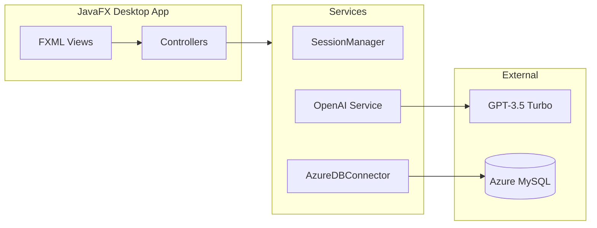

<div align="center">

# 🍽️ FlavorBot

### AI-Powered Recipe Generator

🧑‍🍳 **Smart Recipe Creation** — *Enter ingredients, set preferences, get personalized recipes instantly*

[](https://openjdk.org/)
[](https://openjfx.io/)
[](https://openai.com/)
[](https://azure.microsoft.com/products/mysql/)

---

**[📖 Architecture](ARCHITECTURE.md)** · **[✨ Features](FEATURES.md)** · **[🛠️ Tech Stack](TECH_STACK.md)**

</div>

---

## 📸 Screenshots

<div align="center">

| Login | Main Dashboard |
|:---:|:---:|
|  |  |

| Preferences | Recipe Generation |
|:---:|:---:|
|  |  |

| Virtual Fridge |
|:---:|
|  |

</div>

---

## 🎥 Demo Video

[](https://www.youtube.com/watch?v=0UNjeKQFY9I)

> **What you'll see**: Ingredient input → Preference selection → AI recipe generation → Export & share

---

## ✨ Features

| Feature | Description |
|---------|-------------|
| 🤖 **AI Recipe Generation** | GPT-3.5 powered recipes based on your ingredients |
| 🧊 **Virtual Fridge** | Store and manage your available ingredients |
| 🔄 **Drag-and-Drop** | Intuitive ingredient transfer to recipe generator |
| ⚙️ **User Preferences** | Dietary restrictions, skill level, cuisine preferences |
| 📄 **Export Recipes** | Save generated recipes to file |
| 📧 **Email Sharing** | Send recipes directly to friends and family |
| ⭐ **Recipe Rating** | Rate generated recipes for feedback |
| 🎨 **Frosted Glass UI** | Modern glassmorphic design aesthetic |

---

## 🏗️ Architecture Overview



> 📖 **[View Full Architecture →](ARCHITECTURE.md)**

---

## 🛠️ Tech Stack

| Layer | Technologies |
|-------|-------------|
| **Core** | Java 23, JavaFX 23 |
| **Build** | Maven, javafx-maven-plugin |
| **Database** | MySQL 8.0 on Azure |
| **AI** | OpenAI GPT-3.5 Turbo |
| **Email** | Jakarta Mail 2.0.1 |
| **Styling** | CSS with Glassmorphism |

> 🛠️ **[View Full Tech Stack →](TECH_STACK.md)**

---

## 🚀 Getting Started

### Prerequisites

- Java JDK 23 or higher
- Maven 3.x
- OpenAI API key

### Installation

```bash
# Clone the repository
git clone https://github.com/sahilkamalny/FlavorBot.git
cd FlavorBot

# Set your OpenAI API key
set key=your_openai_api_key_here   # Windows
export key=your_openai_api_key_here # macOS/Linux

# Build and run
mvn clean install
mvn javafx:run
```

### Environment Variables

| Variable | Description |
|----------|-------------|
| `key` | OpenAI API key for recipe generation |

---

## 📁 Project Structure

```
FlavorBot/
├── src/main/java/edu/farmingdale/recipegenerator/
│   ├── HelloApplication.java    # App entry point
│   ├── MainController.java      # Main dashboard
│   ├── LoginController.java     # Authentication
│   ├── PreferencesController.java
│   ├── FridgeController.java    # Ingredient management
│   ├── OpenAI.java              # AI integration
│   ├── AzureDBConnector.java    # Database layer
│   └── SessionManager.java      # User session
├── src/main/resources/
│   ├── Styling/                 # CSS stylesheets
│   └── edu/farmingdale/recipegenerator/
│       └── *.fxml               # UI layouts
└── pom.xml
```

---

## 🧪 How to Use

1. **Launch** the application
2. **Login** or create a new account
3. **Set Preferences** — dietary restrictions, skill level, cuisines
4. **Add Ingredients** — type or drag from virtual fridge
5. **Generate Recipe** — click Generate for AI-powered results
6. **Export/Share** — save to file or send via email

---

## 🙋‍♂️ Authors

| Name | GitHub |
|------|--------|
| Haris Akbar | [@ha.akbar03](https://github.com/ha.akbar03) |
| Jonatan Paulino | [@JPR420](https://github.com/JPR420) |
| Andrew Escorcia | [@aescorcia65](https://github.com/aescorcia65) |
| Sahil Kamal | [@sahilkamalny](https://github.com/sahilkamalny) |

---

<div align="center">

### 📖 Additional Documentation

**[Architecture →](ARCHITECTURE.md)** · **[Features →](FEATURES.md)** · **[Tech Stack →](TECH_STACK.md)**

---

**Happy cooking! 👨‍🍳👩‍🍳**

</div>
